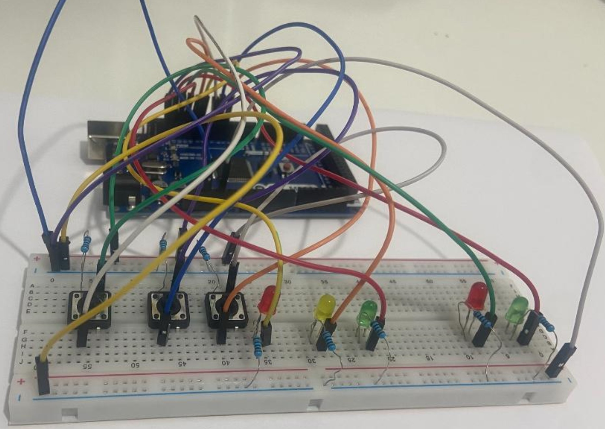

# MATLAB & Simulink Projekte / Projects 🚦🚂⚙️

Dieses Repository enthält verschiedene Modelle und Simulationen, die mit **MATLAB** und **Simulink** erstellt wurden.  
Die Themen reichen von Steuerungslogik über Zustandsautomaten in Stateflow bis hin zu digitalen Schaltungen.  

This repository contains various models and simulations created with **MATLAB** and **Simulink**.  
The topics range from control logic and state machines in Stateflow to digital circuit design.

---

## 📂 Projekte / Projects

### 1. Ampelsteuerung / Traffic Light Control
**Datei / File:** `ampel_steuerung.slx`  

- Modell einer Verkehrsampel in **Stateflow**.  
- Enthält die vollständige Ablaufsteuerung mit:  
  - Startphase (gelbes Blinken).  
  - Betrieb mit Umschaltung zwischen Fahrzeug- und Fußgängerampel (Rot, Rot-Gelb, Grün, Gelb).  
  - Behandlung eines Tasters für Fußgängeranforderungen.  
  - Notfallmodus, bei dem alle Signale auf Rot geschaltet werden.  

- Model of a traffic light using **Stateflow**.  
- Includes the full sequence control with:  
  - Start phase (yellow blinking).  
  - Operation with switching between vehicle and pedestrian lights (red, red-yellow, green, yellow).  
  - Pedestrian push-button integration.  
  - Emergency mode, setting all signals to red.  

📷 **Diagramm / Diagram**:  
 

---

### 2. Ampelsteuerung mit Arduino / Traffic Light Control with Arduino
**Datei / File:** `ampel_steuerung_mit_arduino.slx`  

- Erweiterung des Ampelmodells zur Ansteuerung eines **Arduino-Boards**.  
- Steuerung von **5 LEDs** (Verkehrs- und Fußgängerampeln).  
- Einsatz von **2 Tastern** zur direkten Beeinflussung der Steuerlogik.  
- Praktische Kopplung zwischen **Simulink** und Hardware.  

- Extension of the traffic light model for controlling an **Arduino board**.  
- Control of **5 LEDs** (traffic and pedestrian lights).  
- Integration of **2 push buttons** to interact with the control logic.  
- Practical coupling between **Simulink** and hardware.  

---

### 3. Bahnübergang / Railway Crossing
**Datei / File:** `Bahn_uebergang.slx`  

- Modell eines **Bahnübergangs** mit Schranken und Warnlicht.  
- Ablauf:  
  - Bei Annäherung eines Zuges beginnt das rote Warnlicht zu blinken.  
  - Nach 10 s schließen sich die ersten Schrankenhälften, nach weiteren 10 s die zweiten.  
  - Während der Zug den Übergang passiert, leuchtet das Warnlicht dauerhaft rot.  
  - Nach der Durchfahrt öffnet sich der Übergang wieder, falls kein weiterer Zug gemeldet ist.  
- Implementierung in **Stateflow** mit kontinuierlicher Zeitsteuerung.  

- Model of a **railway crossing** with barriers and warning light.  
- Sequence:  
  - When a train approaches, the red light starts blinking.  
  - After 10 s, the first barrier halves close; after another 10 s, the second halves close.  
  - While the train passes, the red light stays on.  
  - After the train has passed, the barriers open again if no further train is reported.  
- Implemented in **Stateflow** with continuous time control.  

---

### 4. Vier-Bit-Subtrahierer / Four-Bit Subtractor
**Datei / File:** `vier_Bit_Subtractor.slx`  

- Aufbau eines **4-Bit-Subtrahierers** in Simulink.  
- Verwendete Bausteine:  
  - Halbsubtrahierer (Half Subtractor).  
  - Vollsubtrahierer (Full Subtractor).  
  - Kombination zu einem Subtrahierer für 4-Bit-Zahlen.  
- Eingaben und Ausgaben erfolgen in paralleler Binärdarstellung (über **Mux** und **Demux**).  
- Ausgabe des Ergebnisses über ein Simulink-Display.  
- Umsetzung ausschließlich mit **logischen Gattern, Subsystemen und Konstanten**.  

- Design of a **4-bit subtractor** in Simulink.  
- Components used:  
  - Half Subtractor.  
  - Full Subtractor.  
  - Combination to form a 4-bit subtractor.  
- Inputs and outputs in parallel binary representation (via **Mux** and **Demux**).  
- Output displayed through a Simulink display.  
- Implemented using only **logic gates, subsystems, and constants**.  

---

## 🛠️ Konzepte / Concepts
- **Simulink / Stateflow**: Zustandsautomaten, zeitabhängige Steuerungen.  
- **Hardware-Anbindung / Hardware integration**: Arduino control via Simulink.  
- **Digitale Logik / Digital logic**: binary arithmetic and combinatorial circuits.  
- **Simulationstechniken / Simulation techniques**: modeling of safety-critical scenarios (traffic lights, railway crossing).  

---